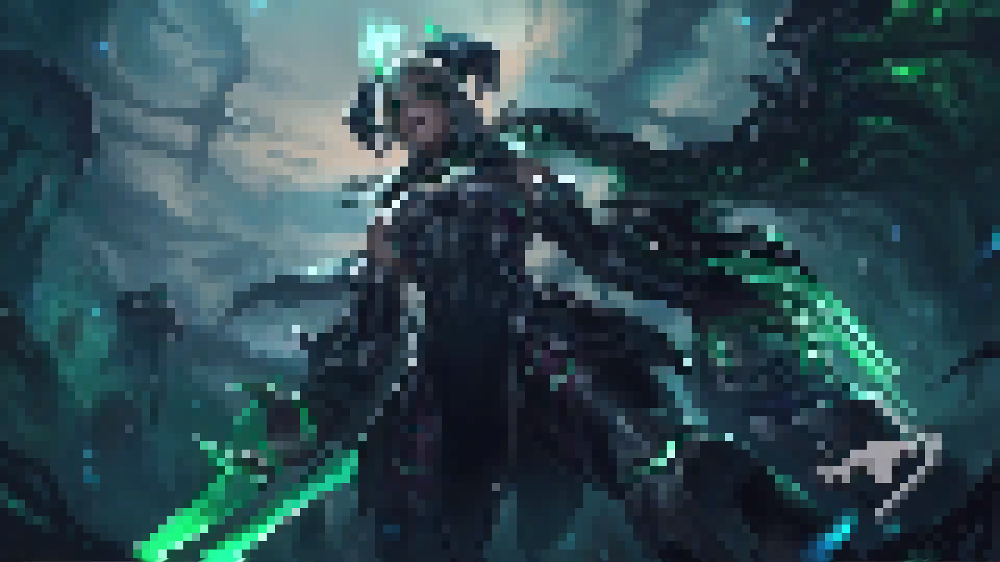

  

  <h1>pixels: a simple pixelation tool</h1>

  Pixels is your go to solution for pixelating images quickly and easily from the command line.

## Highlights
- **Easy to use**, pixels is simple and cross platform. 
- **Lightning fast** - written in Rust, pixels takes advantage of multithreading to supercharge pixelation.

## Features:

- Allows you to define a set number of colors, for which a specific palette is generated to color the image with (WIP). 
- Easily pixelate images - with control over how pixelated an image should be.  

## How to use it

Atlas takes a few arguments - specifically: 
- `-f <filename>` (required) specifies the name of the file to be pixelated.  
- `-l <level>` (required) the pixelation level: higher levels produce less pixelated images - I'd recommend `100`.

## Dependencies
- Uses [image](https://github.com/image-rs/image)

### References 

- 
Cover image is the Ruined Shyvana splash art by <a href="https://www.riotgames.com/en">Riot Games</a>

